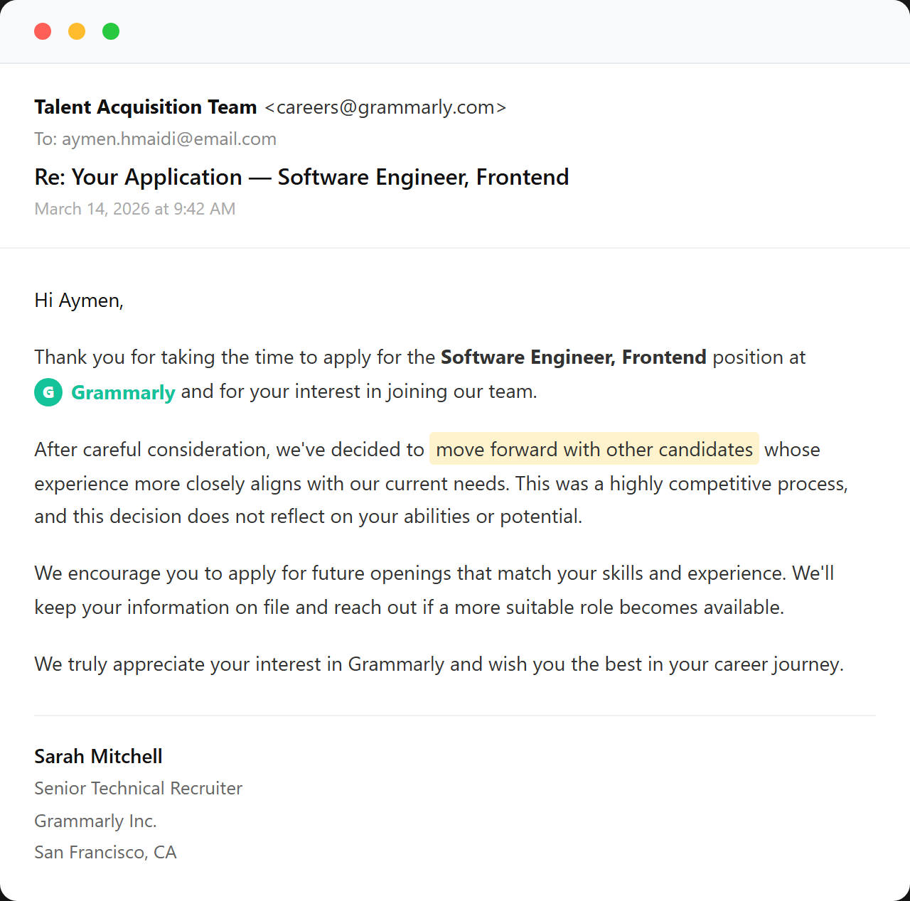
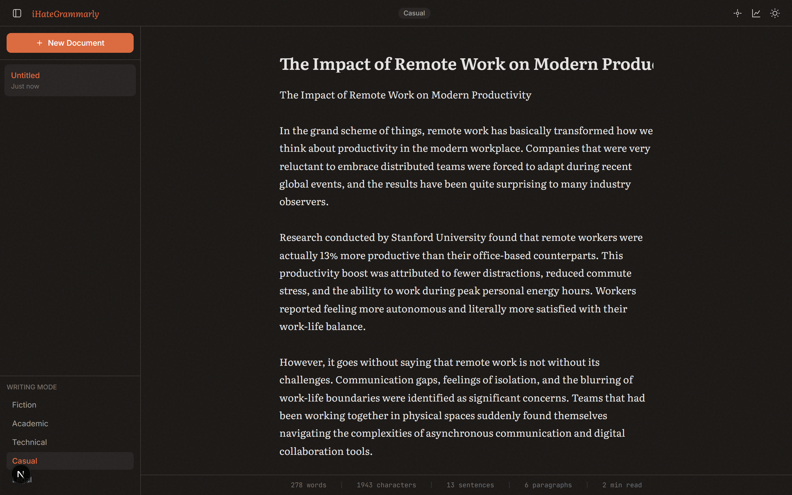
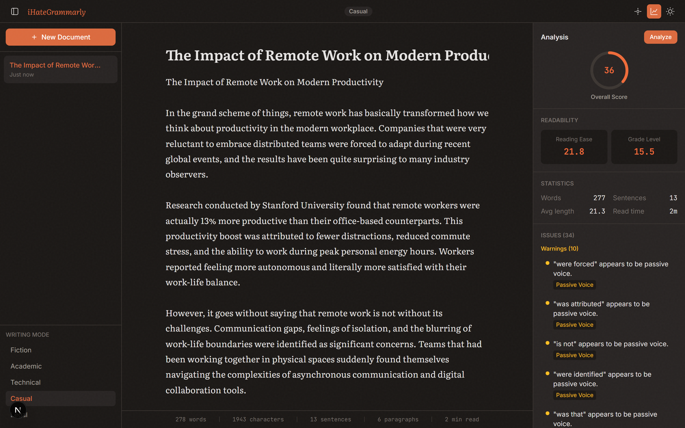
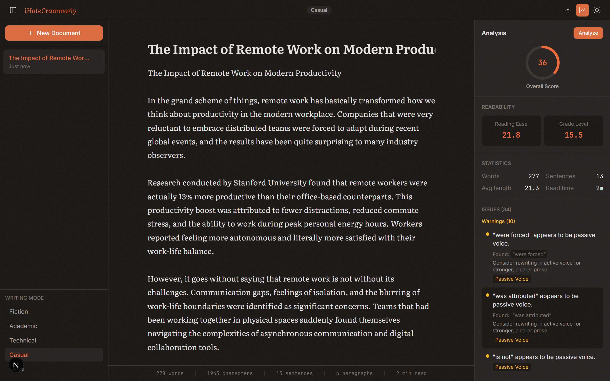
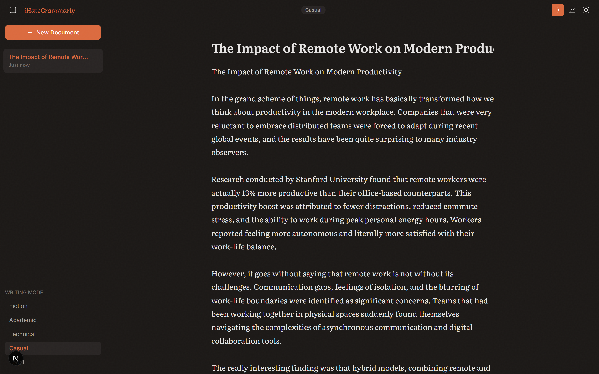
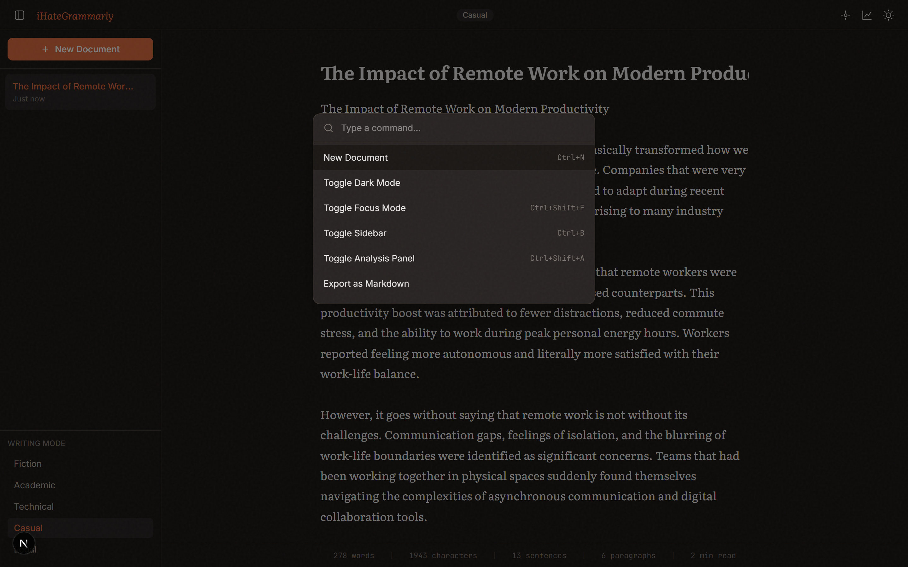
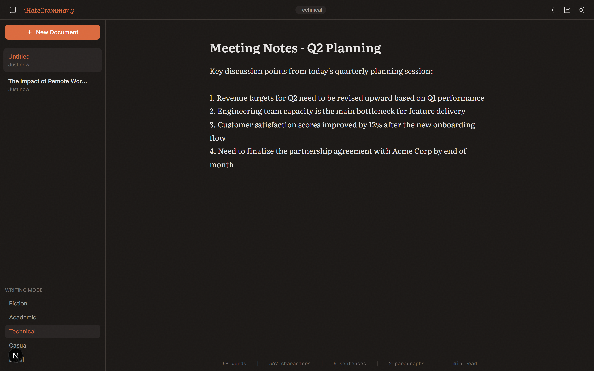
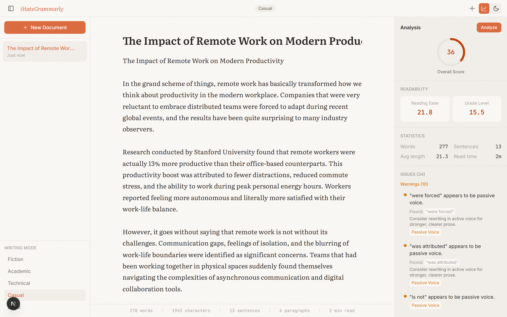

# iHateGrammarly

**Grammarly rejected my job application. So I built an open-source alternative that runs 100% locally, respects your privacy, and doesn't cost $144/year.**

---

### The rejection that started it all

<p align="center">
  
</p>

On March 14, 2026, I received this lovely email from Grammarly's recruiting team. After spending hours on their take-home assignment, I got the classic *"we've decided to move forward with other candidates"* response.

No feedback. No interview. Just vibes.

So I did what any reasonable developer would do — I built the entire product myself. In a weekend. For free. And it doesn't spy on everything you type.

---

## What is this?

A **local-first, open-source writing assistant** that analyzes your grammar, style, and readability — all running in your browser, no data ever leaves your machine.

No account. No subscription. No keylogger disguised as a "writing assistant."

<p align="center">
  
</p>

---

## Features

### Real Writing Analysis
Not just red squiggly lines. Actual analysis with algorithms that work:

- **Readability scoring** — Flesch-Kincaid grade level & reading ease
- **Passive voice detection** — flags `was written`, `were identified`, etc.
- **Adverb overuse** — because you don't need "very" in every sentence
- **Cliche detection** — 30+ phrases that make editors cringe
- **Weasel words** — "basically", "actually", "literally" → flagged
- **Long sentence warnings** — 30+ words? Break it up
- **Repeated word detection** — same word 3x in close proximity
- **Overall score** (0-100) with animated progress ring

<p align="center">
  
</p>

### Click any issue to see why it was flagged and how to fix it:

<p align="center">
  
</p>

### 5 Writing Modes
Different rules for different contexts:
- **Fiction** — relaxed, respects your creative voice
- **Academic** — formal, flags casual language
- **Technical** — precision-focused
- **Casual** — light touch
- **Legal** — strict, conservative suggestions

### Focus Mode
Distraction-free writing. Everything fades away except your words.

<p align="center">
  
</p>

### Command Palette
`Ctrl+K` to access everything instantly. No clicking through menus.

<p align="center">
  
</p>

### Document Management
Multiple documents, auto-save, export to Markdown.

<p align="center">
  
</p>

### Beautiful Light Mode
Because some people write during the day, apparently.

<p align="center">
  
</p>

---

## Why not just use Grammarly?

| | Grammarly | iHateGrammarly |
|---|---|---|
| **Price** | $144/year | Free forever |
| **Privacy** | Sends everything you type to their servers | Nothing leaves your machine |
| **Account required** | Yes | No |
| **Works offline** | No | Yes |
| **Open source** | No | Yes |
| **False positive ratio** | [9:1 reported](https://medium.com/swlh/grammarly-premium-makes-a-lot-of-mistakes-3b5eb431e9d1) | Low — we'd rather miss than cry wolf |
| **Creative writing** | Destroys your voice | Respects it with writing modes |
| **AI detection risk** | Their rewrites get flagged | You wrote it, it's yours |

---

## Getting Started

```bash
git clone https://github.com/aymenhmaidiwastaken/iHateGrammarly.git
cd iHateGrammarly
npm install
npm run dev
```

Open [http://localhost:3000](http://localhost:3000) and start writing.

That's it. No signup. No API key. No cloud. No BS.

---

## Tech Stack

- **Next.js 16** + React 19
- **TypeScript**
- **Tailwind CSS v4**
- **100% client-side** — localStorage for persistence

---

## Keyboard Shortcuts

| Shortcut | Action |
|---|---|
| `Ctrl+K` | Command palette |
| `Ctrl+S` | Save document |
| `Ctrl+B` | Toggle sidebar |
| `Ctrl+Shift+A` | Toggle analysis panel |
| `Ctrl+Shift+F` | Toggle focus mode |

---

## Roadmap

- [ ] Browser extension (Chrome + Firefox)
- [ ] VS Code extension
- [ ] Local LLM integration (Ollama) for AI-powered suggestions
- [ ] Style fingerprinting — learn YOUR writing patterns
- [ ] Multi-language support
- [ ] Plugin system for community rules
- [ ] Export analysis reports (PDF/HTML)

---

## Contributing

PRs welcome. If Grammarly rejected you too, this is your revenge arc.

---

## License

MIT — do whatever you want with it. Unlike Grammarly, I don't own your words.

---

<p align="center">
  <i>Built with spite, shipped with love.</i>
</p>
